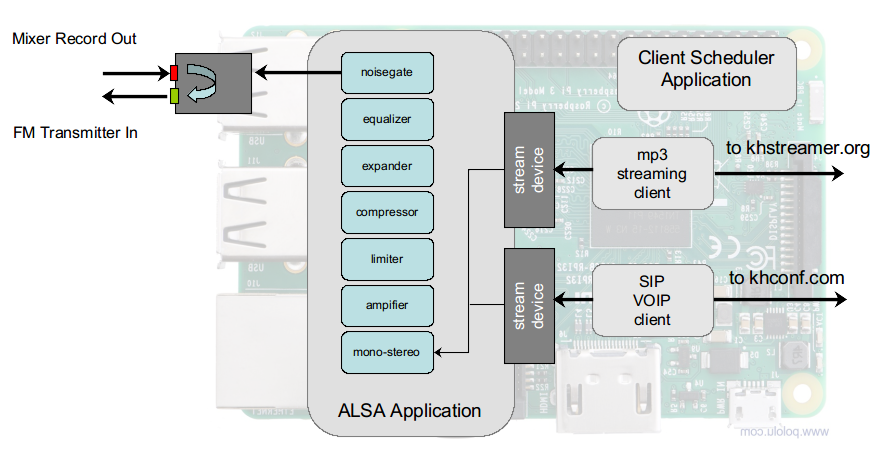
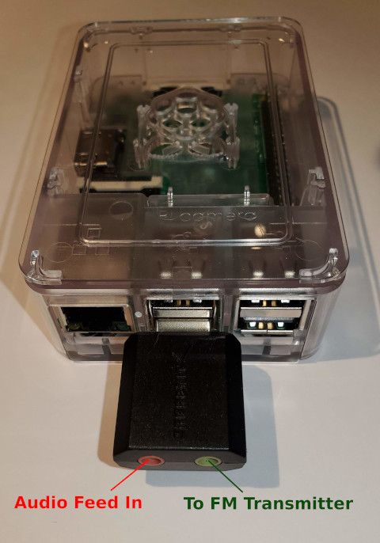
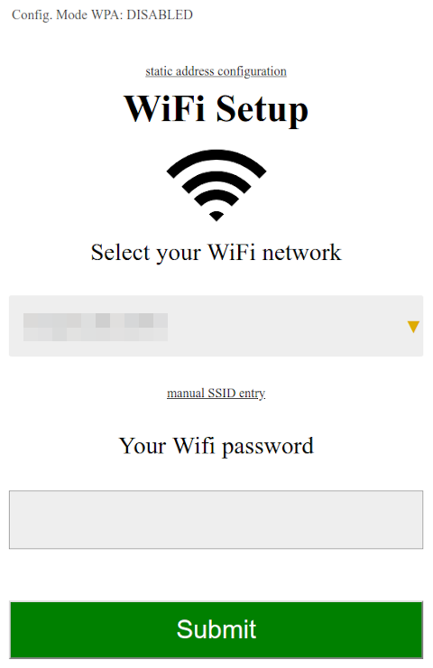
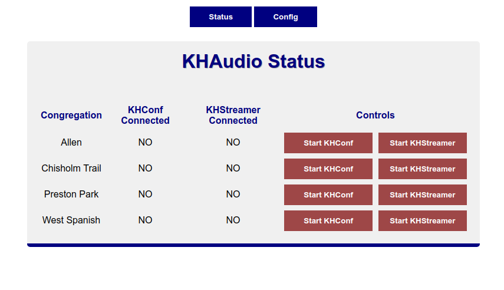
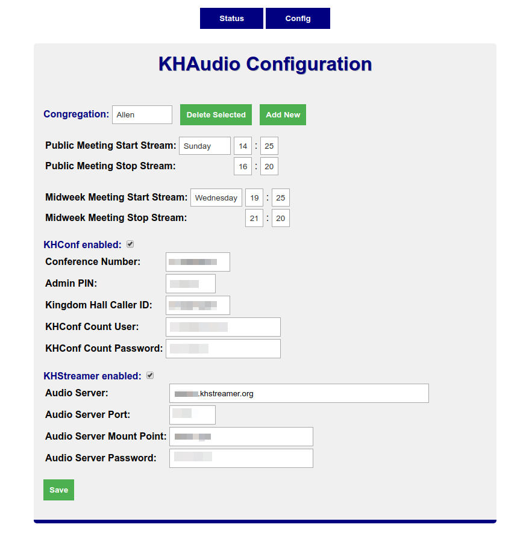

## KHAudio Streaming Device ##

The KHAudio Streaming Device is a Raspberry Pi software appliance which takes an audio feed from your mixer and allows for manual or scheduled initiation of mp3 audio streams to *khstreamer.org* and SIP VOIP (voice over IP - Internet based phone calls) calls to *khconf.com* phone conferencing.

The appliance uses a USB audio interface to take input from your mixer. The input signal is then redirected to the output of the USB audio inteface such that in can be used locally by another application, like FM transmission for hard of hearing. This inline installation reduces the number of outputs required from your mixer.

The input signal from the mixer is internally sent through a chain of digial signal processing to enhance audibility over low bandwidth mp3 streaming and phone conferencing.

The effected signal is then made available to the internal mp3 streaming and SIP VOIP client applications for communications to *khstreaming* and *khconf* services. You can use one or both services.

Obviously you will need Internet access and the KHAudio appliance will need access to the services through your firewall.

A scheduling application, running on the KHAudio appliance, monitors any configured meeting times and will automatically start and then stop enabled service client applications, thus removing the need to manually connect a phone or an mp3 streaming client to your configured services.

The KHAudio appliance can be configured to support multiple congregation meeting schedules. The KHAudio appliance hosts a web user interface to schedule meetings, manually start or stop mp3 streams and SIP VOIP calls, and retrieve *khconf* caller counts (if a *khconf* count user is configured).

A single KHAudio appliance can have one mp3 streaming client and one SIP VOIP client running at the same time. A single congregation can use both mp3 streaming and phone conferencing for the same meeting, but if you want to simultaneously connect to multiple mp3 streams or multiple phone conferences for the same meeting, you will need to build mulitple KHAudio appliances.

### What Hardware to Buy ###

The image builds were designed to work on a Raspberry Pi 3b+ with an Sabrent AU-MMSA USB Audio Interface.

You can get a Raspberry PI from various resellers on the Internet. Buying a kit which includes a case and a proper power supply is the easiest way to make sure you'll get what you need.

[Raspberry Pi 3b+ Kit on Amazon](https://www.amazon.com/CanaKit-Raspberry-Premium-Clear-Supply/dp/B07BC7BMHY)

The Sabrent AU-MMSA USB Audio Interface is also widely available. It is a very affordable device (less then 10 USD).

[Sabrent AU-MMSA USB Audio Interface Interface on Amazon](https://www.amazon.com/gp/product/B00IRVQ0F8)

You'll need a microSD card, 8GB or larger suggested.

[A Cheap microSD card on Amazon](https://www.amazon.com/Sandisk-Ultra-Micro-UHS-I-Adapter/dp/B073K14CVB)

Assembly is pretty obvious :smile:

### Quickstart Installation ###

[Download the KHAudio image (click here)](https://www.dropbox.com/s/tv3gnztc56gjlrv/khaudio.img?dl=1)

Once you download the disk image, simply follow the [Raspberry Pi Foundation's instructions](https://www.raspberrypi.org/documentation/installation/installing-images/) for *Writing an image to the SD card*.

When the disk image has been downloaded and written to your microSD card, insert the microSD card into your Raspberry Pi and plug it in!

### Connecting the Raspberry Pi to your Network ###

When you power up the KHAudio appliance you will see a WiFi SSID labeled `KH Audio Wireless Setup`. Connect to this Wifi access point, then open a web browser to the following address:

[http://10.0.0.1](http://10.0.0.1)

You will be presented with an interface that will let you provision your networking.

#### Static Address Configuration ####

*It is strongly suggested that you give the KHAudio appliance a static network address suitable for your facility. You can do this by clicking on the `static address configuration` link on the page above. From that link you will be asked if you want to use Wired Ethernet networking or WiFi Networking, the static IP address, the gateway address, and a DNS server address. If you choose Wired Ethernet networking, your static address configuration will be accepted and your KHAudio appliance will reboot. If you choose WiFi networking your browser will return to the main page to enable you to select your WiFi network and provide the appropriate security configuration. Once configured you can simply open a web browser to:*

`http://[static_address]`

If your web browser's operating system is capable of using mDNS, the KHAudio appliance can be discovered with the name:

[http://khaudio.local](http://khaudio.local)

#### Dynamic Address Configuration ####

If you can not provide a static address, provision your WiFi (or simply plug in the wired Ethernet connection).

The KHAudio appliance will request a DHCP lease identifying itself with the name `khaudio`. If your DHCP and DNS services are tied together (common for Internet service provider DHCP/DNS services), you can simply open a web browser and go the following address:

[http://khaudio](http://khaudio)

If your web browser's operating system is capable of using mDNS, the KHAudio appliance can be discovered with the name:

[http://khaudio.local](http://khaudio.local)

If neither of these work with your Internet provider or web client, you will need to get the address allocated by your network by consulting your DHCP service connected clients/leases list. Look for `khaudio`. You can determine the IP address allocated from that list. Once you have the IP address, open a web brower to that address. As an example if your DHCP service shows the `khaudio` device was allocated the address `192.168.1.45`, you would open a browser to the following address:

`http://192.168.1.45`

It is recommended that you reserve the DHCP lease address in your DHCP service setup, allowing the KHAudio device to retrieve the same IP address each time it requests a lease renewal. You will also want to increase the lease period for the KHAudio appliance to as long as possible (typically 24h - 86400 seconds). Both of these precations will avoid the KHAudio appliance changing address and interupting service during a meeting.

### Using the Web User Interface ###

The Web user inteface has two screens, one to display the current appliance status, the other to configure meeting times and service parameters. To refesh each page, simply click the status or config buttons on the top of the interface.

#### The Status Page ####

The status page can be used to see if *khconf* phone conferencing or *khstreamer* streaming are active. You can optionally start or stop client applications manually.

#### The Configuration Page ####

The configuration page allows you to configure start and stop schedules for multiple congregations. You can then configure and enable *khconf* or *khstreaming* services.

### Troubleshooting Issues ###

Please make sure you have allowed access for your KHAudio device through your firewall. It will optionally need access to your *khstreamer.org* audio streaming host as well as *reports.khconf.com* and *sipgw.khconf.com*.

If you are experiencing other issues, please fill out a github issue in this repository.
